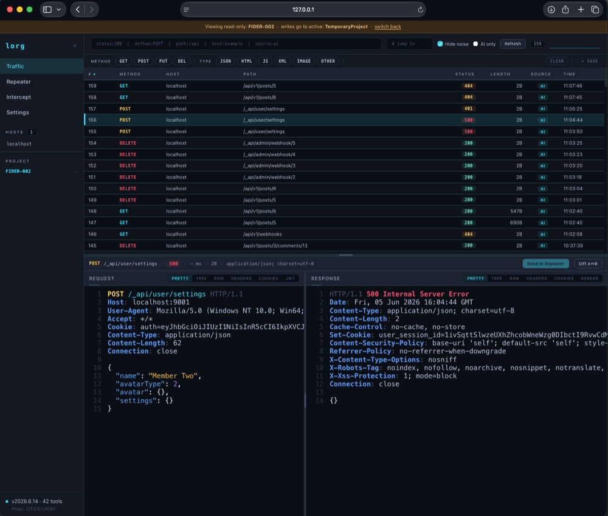
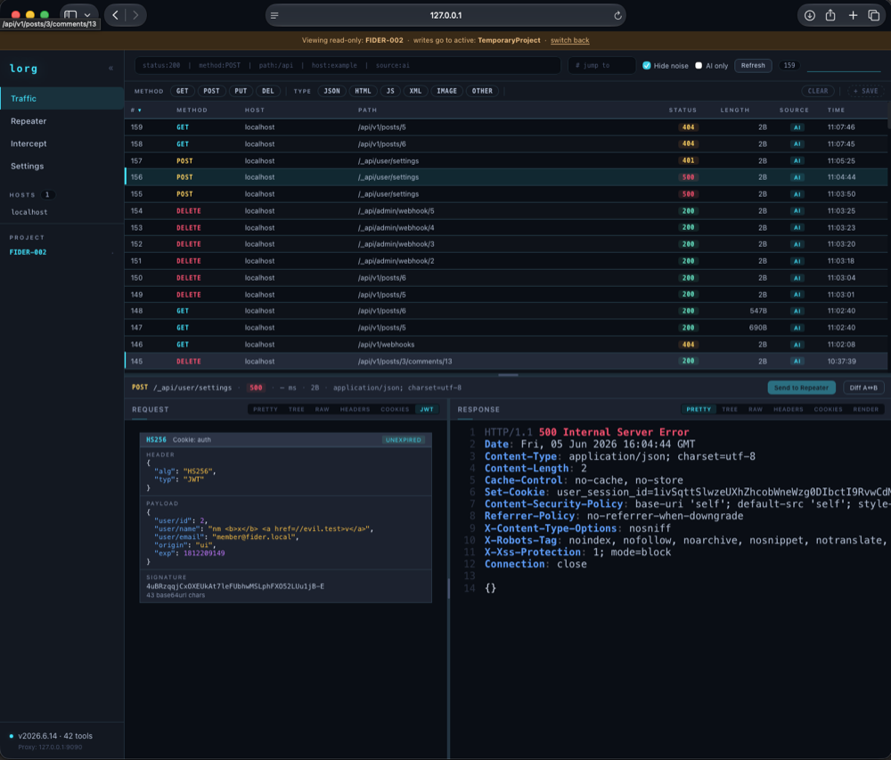
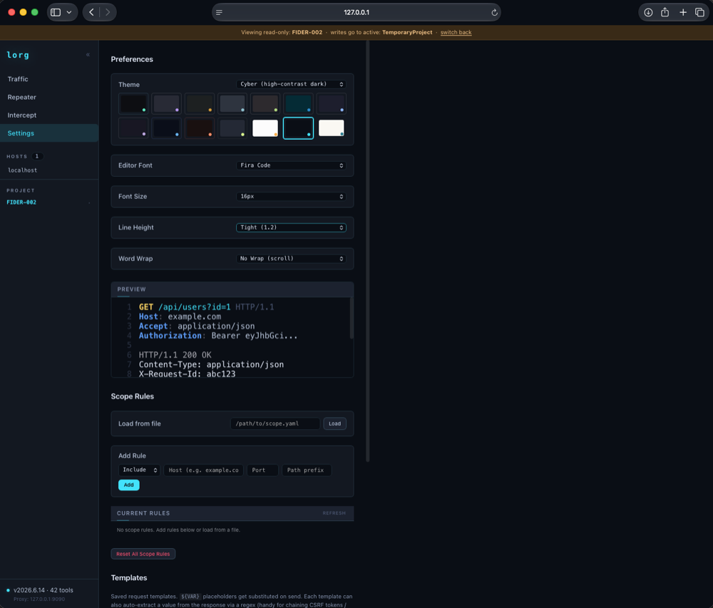

# lorg

**AI-powered penetration testing proxy** — comprehensive MCP tooling, anti-detect browser integration, and per-project SQLite databases.

*lorg* (Gaelic: track, trace, trail) is a security testing toolkit that combines an intercepting HTTP/HTTPS proxy with a comprehensive MCP (Model Context Protocol) server. Designed to be driven by AI agents like Claude Code, it provides everything needed for web application security assessments without requiring a Burp Suite license.

## Screenshots

**Traffic viewer** — live capture table with the selected request and response shown below. Reads union across every project DB while writes stay addressed to the active project.



**Request / response viewer** — inspect any captured request and its response with full syntax highlighting.



**Settings** — 12 built-in themes, editor preferences, scope rules, and request templates. The banner shows per-project addressing in action: one project open read-only while sends land in the active project.



## Features

- **Intercepting Proxy** — HTTP/1.1, HTTP/2, WebSocket with TLS fingerprint mimicry (uTLS)
- **MCP Tooling** — request sending, session management, JWT attacks, race conditions, GraphQL testing, scope enforcement, response analysis, and more (`/mcp/health` lists the live surface)
- **Browser Integration** — CamoFox (anti-fingerprint Firefox) driven by `browser` / `browserInteract` / `browserExec` / `browserSec` for XSS verification, CSP bypass, and DOM-sink testing
- **Per-Project SQLite DB** — all traffic logged in real-time to one SQLite DB per project (`http_traffic` / `http_messages`, burp-mcp-enhanced schema). Each project is a self-contained engagement; the agent can address any project per call without disturbing the UI's view
- **Minimal Web UI** — traffic viewer, repeater, syntax highlighting, multiple color themes, resizable panes
- **Per-Project Session Management** — each project keeps its own named sessions / cookie jars (CSRF auto-capture/injection), with explicit cross-project cookie copy
- **No License Required** — fully open source, runs headless or with UI

## Quick Start

```bash
# Build
go build -o lorg ./cmd/lorg/

# Run — API/UI on 127.0.0.1:8090, MITM proxy auto-started
./lorg -host 127.0.0.1:8090 -path ~/.lorg/default

# Optional flags:
#   -projects-dir <dir>   per-project SQLite DBs (default: ~/.lorg/projects)
#   -mcp-token   <token>  bearer token for the /mcp endpoint
#   -log                  verbose logging

# Open UI
open http://127.0.0.1:8090
```

## MCP Integration

Add to your `.mcp.json`:

```json
{
  "mcpServers": {
    "lorg": {
      "type": "sse",
      "url": "http://127.0.0.1:8090/mcp/sse"
    }
  }
}
```

## Tool Categories

| Category | Tools | Actions |
|---|---|---|
| **Request Sending** | `sendHttpRequest`, `mirror`, `sendRaw`, `exportCurl` | Structured HTTP with session inject + CSRF + redirects + regex extract; `mirror` re-fires a captured row with small mutations (~10× cheaper); `sendRaw` for raw TCP/TLS bytes or HTTP/2 sequences (request smuggling, malformed framing) |
| **Browser** | `browser`, `browserInteract`, `browserExec`, `browserSec` | CamoFox tabs, page interaction, JS exec, security/admin (auth + XSS + config) |
| **Intercept** | `intercept` | toggle, list, getRaw, forward, drop |
| **Hosts** | `host` | list, info, sitemap, rows, getNote, setNote, modifyLabels, modifyNotes |
| **Session** | `session` | create, list, switch, delete, getHeaders, updateCookies, getCookies, setCookie, csrfExtract, copyCookies — per-project cookie jars (each project has its own); `copyCookies` moves selected cookies between project jars |
| **JWT** | `jwt` | decode, forge, noneAttack, keyConfusion, bruteforce |
| **Scope** | `scope` | load (YAML), check, checkMultiple, getRules, addRule, removeRule, reset |
| **Templates** | `template` | register, send, sendBatch, sendSequence, list, delete |
| **Fuzzing** | `fuzz`, `raceTest`, `authzTest` | Marker fuzzing; race conditions (parallel, h2SinglePacket, lastByteSync); session-swap authz testing |
| **Traffic** | `searchTraffic`, `query`, `gatherContext`, `mapEndpoints`, `clusterResponses`, `findAnomalies`, `probeAuth`, `generateWordlist` | Search, query (HTTPQL), per-host stats, endpoint mapping, response clustering, anomaly + auth boundary surfacing |
| **Tags** | `trafficTag` | add, get, list, delete |
| **Response Analysis** | `responseAnalysis` | analyzeResponse/Variations/Keywords, extractRegex/JsonPath/Between, diffResponses/ById/Structural/Json |
| **GraphQL** | `graphql` | introspect (with bypass techniques), buildQuery, suggestPayloads |
| **OpenAPI** | `openapi` | import, listEndpoints, generateRequests |
| **Project** | `project` | list, register, setActive, useProject, archive, unarchive, delete, autoArchive, setup, info, setName, export, setLogging, setRedactionMode, getRedactionMode — full project lifecycle; `useProject` sets a sticky per-connection default so addressed sends don't repeat `project:` |
| **Proxy** | `proxyList`, `proxyStart`, `proxyStop`, `matchReplace` | Lifecycle + match/replace rules |
| **Encoding** | `encode` | urlEncode, urlDecode, b64Encode, b64Decode, random |
| **Wire / Streams** | `protobuf`, `websocket`, `sseClient`, `ja4`, `oob` | Protobuf decoding, WebSocket inspection, SSE client, JA4 fingerprints, OOB callback server |
| **Data** | `getRequestResponseFromID`, `lorgStatus` | Fetch raw req/resp by ID, runtime status |

## Architecture

```
Claude Code --> lorg MCP (port 8090) --> CamoFox (port 9377) --> Firefox
                       |
                       |-- lorg proxy (port 9090) <-- all HTTP traffic
                       |
                       '-- Per-Project SQLite DBs <-- one file per project
                              (http_traffic + http_messages, burp-mcp-enhanced schema)
```

All captured traffic lives in the per-project SQLite stores — each project (engagement)
is one portable, independently-archivable file. Sends can be addressed to any project
per call; reads (search / query / cluster / mirror / authz) union across project DBs.
The lorgdb config DB still holds proxies, scope, match/replace, templates, and project
metadata (the legacy global `_data`/`_req`/`_resp` traffic tables were retired).

## UI Themes

12 built-in themes: Obsidian (default), Dracula, Gruvbox, Nord, Monokai Pro, Solarized Dark, Catppuccin Mocha, Rosé Pine, Midnight Blue, Ember, Ayu Mirage Plus, Ayu Light.

## Requirements

- Go 1.24+
- CamoFox (optional, for browser testing)

## Based On

